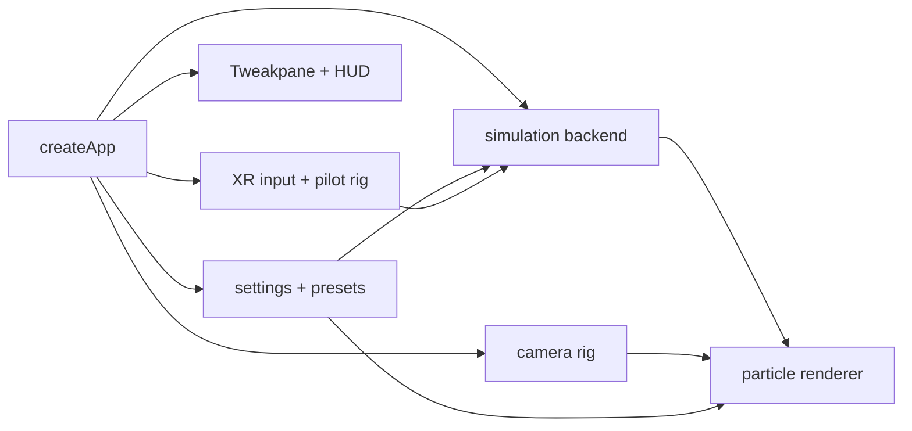

# Murmuration

A browser-based 3D murmuration simulation built with Three.js, Vite, and TypeScript.
It renders thousands of particles as a living flock with tunable movement, trails,
threat responses, environment media, desktop camera controls, and experimental XR
support.

Live demo: [crs48.github.io/murmuration](https://crs48.github.io/murmuration/)

## Run Locally

```bash
npm install
npm run dev
```

The dev server runs on `http://127.0.0.1:5173/` by default.

## Scripts

```bash
npm run dev       # Start the Vite dev server
npm run build     # Type-check and build production assets
npm run test      # Run unit tests
npm run test:e2e  # Run Playwright end-to-end tests
npm run typecheck # Run TypeScript without building
```

## Controls

- Orbit, pan, and zoom the camera with mouse or touch controls.
- Use the Tweakpane panel to adjust particle count, flocking rules, attractor
  movement, visual style, trails, performance settings, and simulation backend.
- Use `R` to reset the camera.
- In supported WebXR environments, use controller input to steer and scale the
  swarm core.

## Architecture



The app selects between CPU, WebGL GPGPU, and WebGPU simulation paths depending
on settings and runtime capability. The CPU path is useful for correctness and
fallback behavior, while the GPU paths support larger particle counts.

## Development Notes

- Source lives under `src/`.
- Playwright tests live under `e2e/`.
- Explorations and design notes live under `docs/`.
- Build output is generated under `dist/`.
