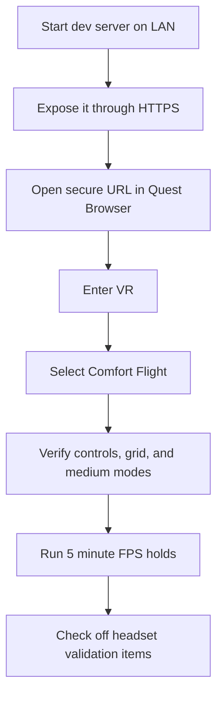

# Quest 2 WebXR Testing

This workflow is for testing the browser-first VR prototype on a Meta Quest 2 from the same network as the development machine.

## Goal

Verify the headset-only checklist items from [`0001_[_]_FULL_3D_IMMERSIVE_VR_SWARM_SIMULATION_FOR_QUEST_II.md`](./explorations/0001_%5B_%5D_FULL_3D_IMMERSIVE_VR_SWARM_SIMULATION_FOR_QUEST_II.md):

- Quest 2 can enter immersive VR from a secure URL.
- The swarm renders in stereo.
- Quest Touch controller handedness, sticks, triggers, grips, and haptics behave safely.
- Comfort presets hold the target frame rate for sustained sessions.



## Local Server

Run Vite on a LAN-visible address:

```bash
/Users/crs/.cache/codex-runtimes/codex-primary-runtime/dependencies/node/bin/node node_modules/vite/bin/vite.js --host 0.0.0.0 --port 5173
```

Find the Mac's LAN IP:

```bash
ipconfig getifaddr en0
```

The HTTP URL will look like:

```text
http://<LAN-IP>:5173/
```

Quest Browser needs a secure context for immersive WebXR. `localhost` is not useful from the headset, so use one of these HTTPS options:

- A trusted local reverse proxy or tunnel, such as Cloudflare Tunnel, ngrok, or Tailscale Funnel.
- A locally trusted certificate and HTTPS reverse proxy that forwards to Vite.
- A deployed preview URL for the current branch.

The secure headset URL should look like:

```text
https://<trusted-host>/
```

## Headset Pass

1. Open the secure URL in Quest Browser.
2. Confirm the HUD says `vr ready` or the VR button is available.
3. Enter VR.
4. Select `Comfort Flight`.
5. Verify the in-scene status panel appears below the forward gaze line.
6. Move the right stick forward and aim the right controller to steer the swarm core.
7. Use the left stick to zoom the local radius and roll.
8. Use right grip to gather and left grip to scatter.
9. Use trigger/pulse actions and confirm the app remains playable even if haptics do not fire.
10. Cycle `grid`, `dust`, `air`, and `starlight` from the desktop panel before entering VR or from future in-scene UI.

## Soak Pass

Run each preset for 5 minutes:

- `Comfort Flight`
- `Swarm Pilot`
- `Quest 2 Dense`

Record:

- Average HUD frame time.
- Lowest observed FPS.
- Whether adaptive quality changed count, trails, or pixel ratio.
- Any controller disconnects or missing gamepad state.
- Any discomfort from steering, zoom, roll, or acceleration.

## Remote Debugging

Use desktop DevTools for console errors and WebXR session diagnostics:

1. Enable Developer Mode for the Quest account/device.
2. Connect the Quest 2 to the Mac with USB.
3. Accept the USB debugging prompt inside the headset.
4. Confirm the device is visible through ADB or Meta Quest Developer Hub.
5. Open Chrome on the Mac and go to:

```text
chrome://inspect/#devices
```

6. Open the secure WebXR URL in Quest Browser.
7. Click `inspect` for the Quest Browser tab.
8. Watch console errors, WebGL warnings, FPS HUD values, and network/certificate failures.

If the headset is not available, use Meta's Immersive Web Emulator for desktop controller and pose iteration. Treat emulator results as input-flow smoke tests only; do not use them to check off Quest 2 frame-rate or comfort validation.

References:

- [Chrome DevTools: Remote debug Android devices](https://developer.chrome.com/docs/devtools/remote-debugging)
- [Meta Quest Immersive Web Emulator](https://github.com/meta-quest/immersive-web-emulator)

## Checklist Update Rules

Only check off Quest 2 validation items after an actual headset run. Desktop Playwright, WebXR emulators, and local screenshots are useful smoke tests, but they do not validate Quest 2 frame pacing, controller mapping, haptics, or comfort.
