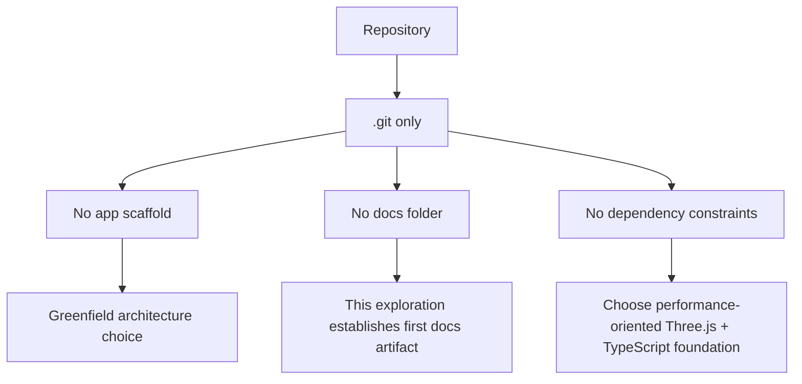
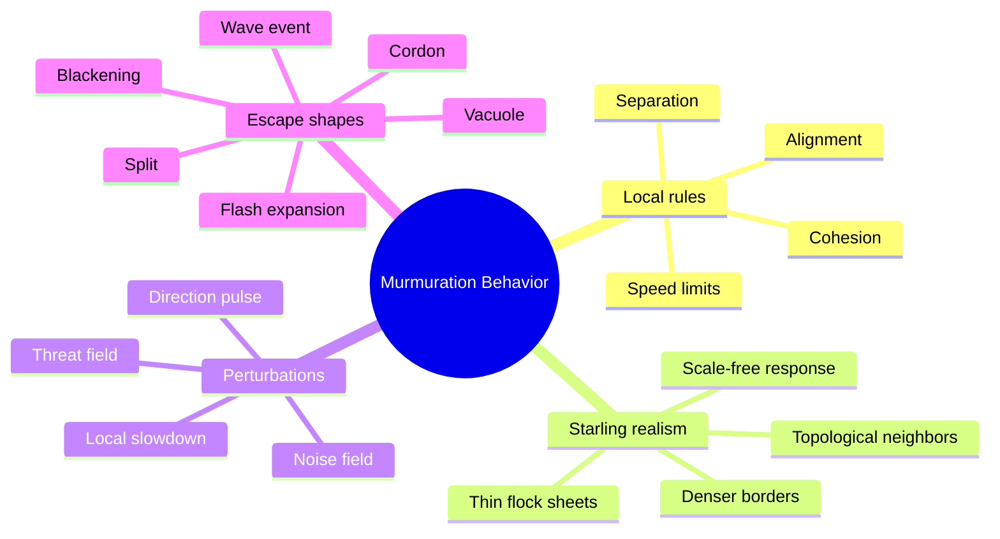
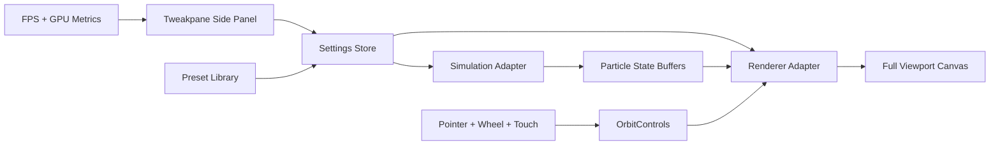
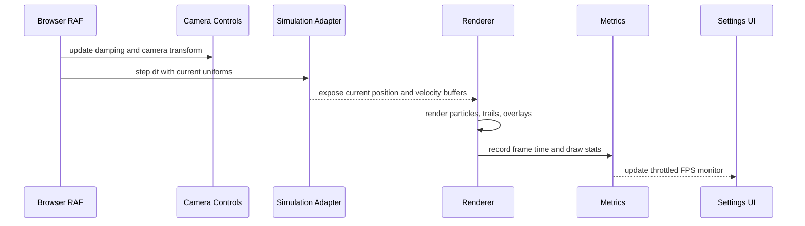
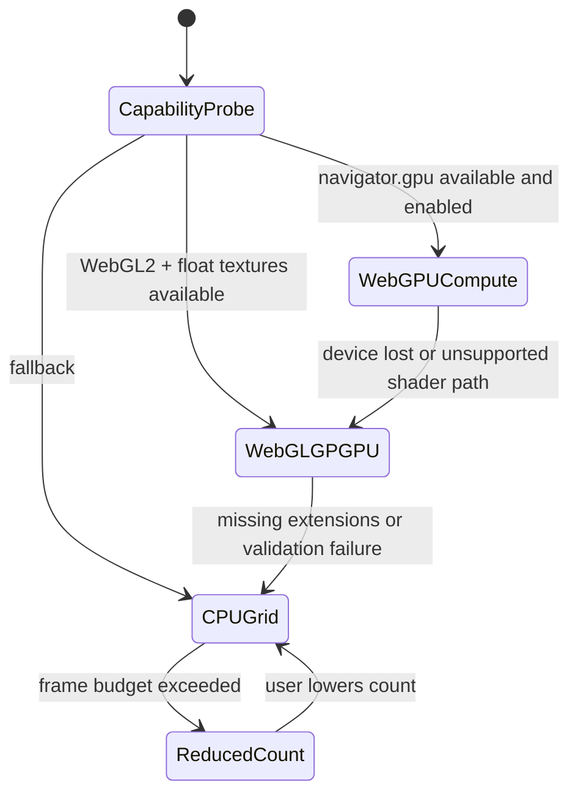
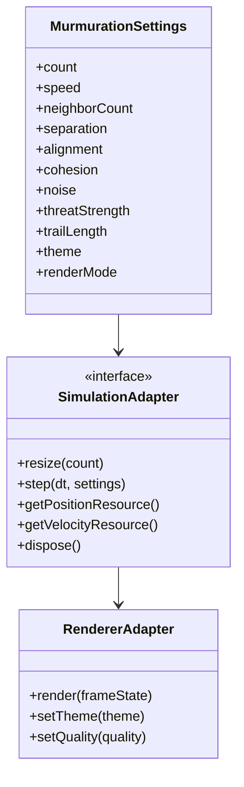
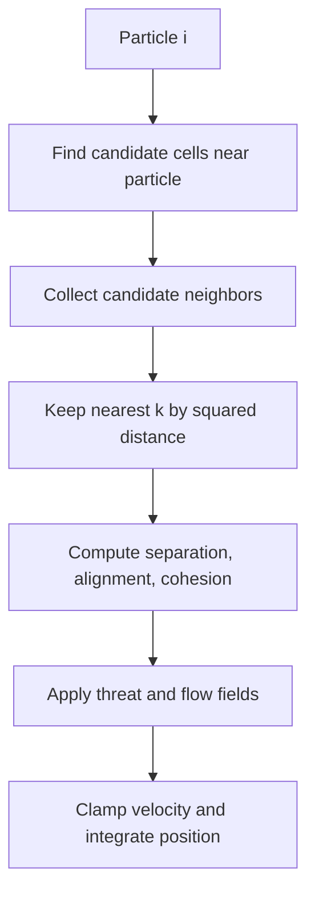
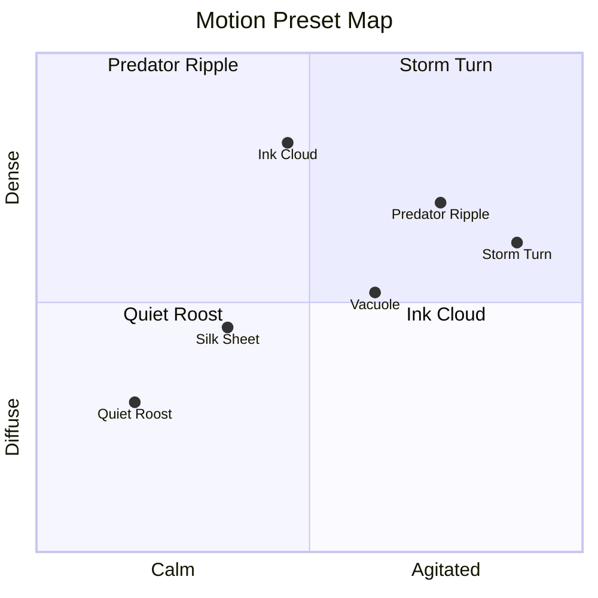
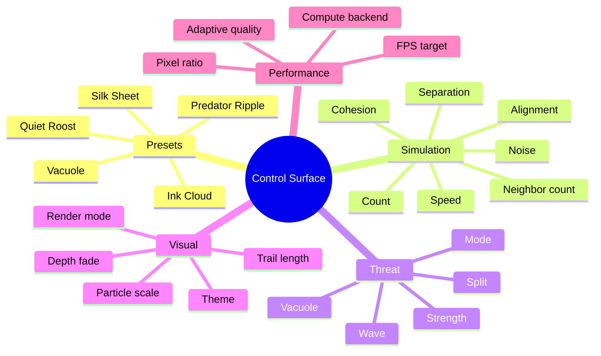
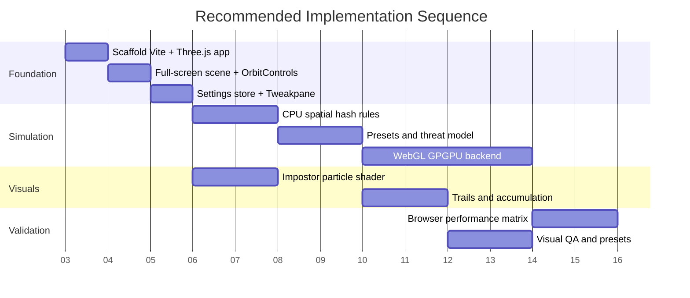

# Web-Based Three-Dimensional Murmuration Simulation

Status: `[_]` exploration  
Generated: 2026-06-03  
Repository: `/Users/crs/Documents/murmuration`

## Problem Statement

Build a web-based, three-dimensional murmuration simulation that is visually minimal, aesthetically rich, and fast enough to support hundreds, thousands, and eventually tens of thousands of moving sphere-like particles. The scene should feel like a flock of starlings, not a generic particle cloud: density should breathe, local changes should ripple through the group, the flock should form voids and sheets, and optional threat behavior should create flashes, waves, splits, and tightening.

The desired product is a usable first-screen experience with:

- A full-viewport 3D scene.
- Black particles on white, white particles on black, and a small set of restrained monochrome themes.
- Cursor, scroll, and pinch camera controls for orbit, pan, angle, and zoom.
- A side settings panel with sliders and toggles for count, speed, flocking weights, threat, turbulence, tail length, visual quality, and performance mode.
- Performance-first rendering and simulation paths that do not collapse when particle count scales.

## Executive Summary 🧭

The strongest direction is a single-page TypeScript application using Three.js as the rendering foundation, with a simulation adapter that can run in three tiers:

1. CPU spatial-hash boids for early correctness and debugging.
2. WebGL2 GPGPU using float textures and ping-pong render targets for a performant MVP.
3. WebGPU compute with storage buffers for the eventual high-count path.

For visuals, the default should not be true geometry spheres. Tens of thousands of real spheres multiply vertex count and draw cost too quickly. The recommended default is a custom point-sprite or sphere-impostor shader: one particle becomes one GPU point or small quad, and the fragment shader shades it like a tiny sphere. True instanced sphere meshes should exist only as a low-count quality mode.

For motion, use Reynolds-style separation, cohesion, and alignment as the base, then add starling-specific constraints from empirical research:

- Topological neighborhood bias: use a small nearest-neighbor count, usually around 6 to 8, rather than a purely metric radius.
- Scale-free response: global coherence should emerge from local heading fluctuations, so the system should sit near an ordered-but-sensitive state instead of being locked into perfect alignment.
- Threat modes: predator fields should trigger blackening, waves, vacuoles, splits, and flash expansion instead of merely pushing particles away.
- Shape dynamics: allow thin sheets, dense borders, hollow voids, and transitions among canonical flock shapes.

The aesthetic target is a high-contrast ink study in motion: sparse UI, precise controls, subtle trails, no decorative background noise, no heavy bloom by default, and a strong focus on silhouettes, density, and negative space.

## Current State In The Repository

Observed state:

- The repository currently contains only `.git`.
- There is no `package.json`, source tree, app shell, existing design system, or prior exploration.
- `docs/explorations/` did not exist before this document.
- Git reports `No commits yet on main`.

Implications:

- This is a greenfield app.
- There is no local framework constraint yet.
- The first implementation can choose the runtime and architecture deliberately.
- The exploration should be treated as a product and architecture brief, not a migration plan.



## External Research 🔎

### Flocking Behavior

Craig Reynolds' 1987 boids model remains the practical starting point for generative flocking. It frames flocking as distributed local behavior, usually decomposed into separation, alignment, and cohesion forces. This is useful because it gives a small, tunable control surface, but raw boids often look like a generic swarm unless their neighborhoods, noise, speed limits, and global fields are tuned carefully.

The STARFLAG starling studies are more directly relevant for murmurations. Ballerini et al. found that starling interaction structure is better explained by topological distance than metric distance: a bird responds to a small number of neighbors by rank order rather than all birds within a fixed physical radius. This is important for the simulation because a fixed metric radius tends to fall apart when density changes. A topological rule keeps the flock coherent as it compresses and expands.

Cavagna et al. found scale-free correlations in starling flocks. The design implication is that the simulation should not smooth away every local perturbation. A local slowdown, turn, or threat response should travel across the group. The app should expose sliders for sensitivity, noise, and propagation rather than only global speed and cohesion.

Predation studies add the most aesthetic value. Storms et al. identify collective escape patterns such as blackening, wave events, flash expansion, vacuole, cordon, and split. A more recent 2026 study of rosy starling flocks reports predator-driven shape dynamics and transitions among canonical flock shapes. That supports building predator and void fields as first-class controls, not decorative extras.



### Browser 3D And Compute

Three.js is the best default rendering layer because it already provides scene management, camera controls, WebGL rendering, a WebGPU renderer path, point primitives, instancing, and examples for GPGPU flocking. Three.js `OrbitControls` already covers orbit, zoom, pan, wheel zoom, and pinch-style touch gestures. Three.js `GPUComputationRenderer` and the official WebGL GPGPU birds example are especially relevant because they demonstrate the exact pattern needed for particle simulation: maintain particle state in GPU resources, update it in shader passes, and render from those resources.

WebGPU is the long-term performance target because it exposes compute shaders and storage buffers directly. Chrome's WebGPU compute guide and MDN's WebGPU API documentation both describe compute pipelines where GPU storage buffers are read and written by shader stages. MDN still marks WebGPU as limited availability, so a production-minded app should not make WebGPU the only path unless the target browser list is narrow.

Three.js `PointsMaterial` is helpful for early smoke tests and can render thousands of points quickly, but its point size can be hardware-capped. A custom shader material gives more control over impostor shape, depth fade, velocity-based size, tail compositing, and theme inversion.

### Controls And Panel UX

Tweakpane is a pragmatic fit for the side settings panel. It supports folders, sliders, lists, color inputs, monitors, and preset import/export. It is lighter and more framework-agnostic than a full application UI stack. If the app later becomes React-based, Leva is a reasonable alternative, but it should not drive hot frame state directly because slider changes should update a central settings store, not trigger broad UI rerenders.

## Key Findings

### 1. "Sphere" Should Mean "Sphere-Like Particle" At Scale

True sphere geometry is expensive. Even a low-poly `SphereGeometry` with 8 by 8 segments is many vertices per particle. At 50,000 particles, that becomes millions of vertices before any trail, transparency, sorting, or lighting overhead.

Recommended rendering tiers:

| Tier | Count target | Rendering mode | Use case |
| --- | ---: | --- | --- |
| Debug | 100 to 2,000 | CPU positions + `InstancedMesh` low-poly spheres | Rule debugging and close inspection |
| Default | 1,000 to 50,000 | Custom point-sprite sphere impostors | Main aesthetic mode |
| Extreme | 50,000 to 200,000 | Minimal point shader, reduced trails | Performance demo mode |

### 2. Exact Neighbor Search Is The Hard Part

Naive boids are `O(n^2)`. That fails quickly. CPU fallback needs a 3D uniform grid or spatial hash. GPU paths need either:

- approximate radius search through a spatial grid,
- texture-space sampling for broad influence,
- or a hybrid topological approximation that samples local cells and keeps the best `k` neighbors.

Exact global k-nearest-neighbor on the GPU is unnecessary for the target aesthetic. A stable approximation is better than an exact algorithm that cannot hit frame budgets.

### 3. Murmuration Beauty Comes From Sensitivity, Not Chaos

The system should be near a coherent state with controlled instability:

- Too much cohesion: particles collapse into a ball.
- Too much separation: the flock dissolves.
- Too much alignment: movement becomes a rigid school.
- Too much noise: it looks like dust, not birds.

Interesting murmurations usually come from local perturbations that spread:

- A threat enters at the edge.
- A local region slows and darkens.
- A turn pulse propagates through nearest neighbors.
- A void opens and is wrapped by the flock.
- A sheet folds, stretches, and compresses.

### 4. Visual Minimalism Needs Depth Cues

Black particles on white, or white particles on black, can look flat without depth cues. Use subtle non-color techniques:

- Size attenuation by depth.
- Opacity falloff for far particles.
- Velocity-stretched tails.
- Soft shadow or density accumulation in screen space.
- Slight depth fog that stays monochrome.
- Optional border fade to make the flock feel suspended.

### 5. Sliders Need Presets Or The App Will Feel Fragile

Expose many controls, but give users stable presets:

- `Quiet Roost`: slow, cohesive, soft trails.
- `Ink Cloud`: high density, high contrast, short tails.
- `Predator Ripple`: medium threat with wave propagation.
- `Vacuole`: strong void field that carves holes.
- `Silk Sheet`: thin, planar flock with low turbulence.
- `Storm Turn`: high sensitivity and periodic heading pulses.

Presets should set the entire parameter vector. Sliders then become refinement tools rather than a wall of unexplained numbers.

## Recommended Architecture

Use a small, explicit module boundary around simulation, rendering, controls, and presets.



Suggested source layout for the first implementation:

```text
src/
  main.ts
  app/
    createApp.ts
    settings.ts
    presets.ts
  camera/
    createCameraRig.ts
  controls/
    createPane.ts
  simulation/
    SimulationAdapter.ts
    cpuSpatialHash.ts
    webglGpuCompute.ts
    webgpuCompute.ts
    rules.ts
  rendering/
    createRenderer.ts
    particleMaterial.glsl.ts
    trailMaterial.glsl.ts
    themes.ts
  diagnostics/
    frameStats.ts
    capabilityReport.ts
```

### Runtime Loop

The frame loop should avoid app-level rerenders. Settings changes update mutable uniforms or recreate buffers only when necessary.



### Simulation Modes



### Data Model

Prefer a declarative settings object and data-oriented particle state.



## Motion Model

### Base Acceleration Terms

For each particle:

- `separation`: steer away from too-close neighbors.
- `alignment`: steer toward average neighbor velocity.
- `cohesion`: steer toward average neighbor position.
- `boundary`: steer toward a soft containing volume.
- `flow`: add low-frequency curl or simplex noise to create undulating folds.
- `threat`: steer away from or around predator fields.
- `speed clamp`: enforce min and max speed without freezing local variation.
- `inertia`: smooth heading changes so the flock feels physical.

### Topological Neighbor Approximation

Use `neighborCount` as a visible slider, defaulting near 7. On CPU, a spatial hash can find candidate neighbors from nearby cells and keep the nearest `k`. On GPU, start with cell sampling or texture-neighborhood approximation, then improve if needed.



### Threat And Void Behavior

Threat should not only repel particles. It should change the flock's local response mode.

Recommended threat controls:

| Control | Range | Visual effect |
| --- | ---: | --- |
| Threat strength | 0 to 1 | Pushes local particles around predator field |
| Threat radius | 0.05 to 0.6 scene units | Controls affected region |
| Wave gain | 0 to 2 | Propagates heading and speed changes |
| Vacuole strength | 0 to 2 | Opens hollow regions in flock |
| Blackening gain | 0 to 1 | Compresses density locally |
| Split gain | 0 to 1 | Encourages bifurcation around threat |
| Predator mode | off, orbit, cursor, autonomous | Chooses threat source |

### Aesthetic Presets



## Rendering Strategy

### Default Visual Style

The default scene should be almost austere:

- Full viewport canvas.
- White background with black sphere-like particles, or the inverted mode.
- No grid, no axes, no decorative stars.
- Sparse side panel with compact controls.
- Subtle trails that read as motion blur, not neon effects.
- Optional transparent predator indicator only while threat controls are active.

### Render Paths

| Mode | Particle representation | Strength | Weakness |
| --- | --- | --- | --- |
| `points` | `THREE.Points` with custom shader | Very fast, best for high counts | Hardware point-size limits, less spherical at close zoom |
| `impostor-quads` | Instanced camera-facing quads | Good sphere illusion, controllable size | More vertices than points |
| `instanced-spheres` | `THREE.InstancedMesh` low-poly spheres | Real geometry, close-up quality | Not viable for extreme counts |
| `minimal-dots` | 1-pixel or 2-pixel dots | Extreme count mode | Less sphere-like, less depth |

The recommended default is `impostor-quads` for desktop and `points` for high-count or mobile performance mode.

### Trails

Trail design should be restrained:

- Short monochrome motion tails.
- Velocity-weighted opacity.
- Optional fading accumulation buffer.
- No high-saturation bloom in the default theme.
- Adaptive trail length that reduces itself when frame time exceeds budget.

Implementation options:

1. Screen-space accumulation pass: render particles into an offscreen buffer, fade previous frame, composite current frame.
2. Per-particle history texture: store previous positions for line-strip or ribbon trails.
3. Velocity-stretched impostor: cheapest option, elongate the particle sprite along projected velocity.

Recommendation: start with velocity-stretched impostors, then add screen-space accumulation as a visual mode.

## Side Panel Controls 🎛️

Use a compact right-side panel with grouped controls. Avoid explanatory paragraphs in the UI. The exploration can document semantics, but the product should use concise labels and tooltips.

### Simulation

- Count: logarithmic slider, `128` to `100000`.
- Speed: `0.1` to `5.0`.
- Min speed: `0.0` to `2.0`.
- Max speed: `0.2` to `8.0`.
- Neighbor count: `3` to `12`, default `7`.
- Neighbor radius: `0.02` to `0.5`.
- Separation: `0` to `4`.
- Alignment: `0` to `4`.
- Cohesion: `0` to `4`.
- Inertia: `0` to `1`.
- Noise: `0` to `1`.
- Flow: `0` to `2`.

### Threat

- Threat enabled.
- Threat mode: cursor, orbit, autonomous.
- Strength.
- Radius.
- Wave propagation.
- Vacuole.
- Split.
- Blackening.

### Visual

- Theme: ink, inverse, paper, graphite.
- Particle scale.
- Depth fade.
- Trail mode.
- Trail length.
- Trail opacity.
- Render mode.
- Pixel ratio cap.

### Camera

- Auto orbit.
- Damping.
- FOV.
- Reset camera.
- Focus flock.

### Performance

- Target FPS.
- Adaptive quality.
- Max device pixel ratio.
- Simulation mode: auto, CPU, WebGL GPGPU, WebGPU.
- FPS monitor.
- Particle buffer size readout.



## Options And Tradeoffs

### Framework Choice

| Option | Pros | Cons | Recommendation |
| --- | --- | --- | --- |
| Vanilla TypeScript + Three.js | Lowest UI/runtime overhead, direct frame-loop control | More manual UI composition | Best first choice |
| React + React Three Fiber | Declarative app structure, rich ecosystem | Must isolate high-frequency simulation state from React | Good only if broader app UI is expected |
| Babylon.js | Strong engine features and WebGPU support | Less direct match to existing Three.js GPGPU flocking examples | Not first choice |
| Raw WebGPU | Maximum control | More code, steeper implementation cost, compatibility risk | Future high-count backend |

Recommendation: start with vanilla TypeScript, Vite, Three.js, Tweakpane, and an adapter boundary that can later host WebGPU.

### Simulation Backend

| Backend | Pros | Cons | Best use |
| --- | --- | --- | --- |
| CPU naive | Simple | `O(n^2)`, not scalable | Never beyond tiny demos |
| CPU spatial hash | Easy to test, deterministic, useful fallback | Limited at high counts | Debug mode and fallback |
| WebGL2 GPGPU | Proven in Three.js examples, broad support | Float texture constraints, shader complexity | MVP performance path |
| WebGPU compute | Clean compute model, storage buffers, high ceiling | Limited availability, more setup | Long-term performance target |

### Neighbor Model

| Model | Visual result | Cost | Recommendation |
| --- | --- | --- | --- |
| Metric radius only | Density-sensitive, can break apart | Moderate | Provide as debug toggle only |
| Exact topological kNN | Stable across density | High | Too expensive at large count |
| Grid candidates + topological `k` | Good approximation | Moderate | Recommended |
| Global field only | Beautiful waves, weak individual realism | Low | Use as additive flow, not replacement |

### Visual Representation

| Representation | Aesthetic | Performance | Recommendation |
| --- | --- | --- | --- |
| True spheres | Best close-up | Worst at scale | Low-count inspection mode |
| Instanced low-poly spheres | Good | Medium | Optional quality mode |
| Point sprites | Minimal and fast | Can look flat | High-count mode |
| Sphere impostor quads | Strong balance | Good | Default |

## Recommendation

Build the first version as a Vite + TypeScript + Three.js app with these priorities:

1. Scaffold the app with a full-screen canvas and Tweakpane side panel.
2. Implement CPU spatial-hash simulation first for correctness, presets, and unit tests.
3. Render with custom point or impostor particle shader, not true spheres.
4. Add OrbitControls with damping, zoom-to-cursor if acceptable, pan, wheel, and touch support.
5. Add presets before adding every advanced slider.
6. Port simulation to WebGL2 GPGPU using ping-pong textures.
7. Add trails and threat modes after baseline performance is measured.
8. Keep WebGPU as an adapter target once the WebGL GPGPU path proves the behavior model.

This sequence keeps the app shippable early while preserving a path to tens of thousands of particles.



## Implementation Checklist

- [ ] Create Vite + TypeScript project scaffold.
- [ ] Add Three.js, Tweakpane, and a lightweight test runner.
- [ ] Build a full-viewport canvas with no landing page.
- [ ] Add `OrbitControls` with damping, pan, wheel zoom, and touch gestures.
- [ ] Add a right-side settings panel with grouped controls.
- [ ] Define a declarative `MurmurationSettings` object and preset library.
- [ ] Implement CPU spatial-hash simulation with structure-of-arrays buffers.
- [ ] Add topological neighbor approximation with default neighbor count near 7.
- [ ] Add Reynolds force terms: separation, alignment, cohesion, speed clamp, and boundary steering.
- [ ] Add low-frequency flow field for sheet folding and undulation.
- [ ] Add threat field modes: cursor, orbiting, and autonomous.
- [ ] Add threat response terms for wave, vacuole, split, blackening, and flash expansion.
- [ ] Render particles with a custom point or impostor shader.
- [ ] Add monochrome themes: ink, inverse, paper, graphite.
- [ ] Add velocity-stretched particle tails.
- [ ] Add screen-space accumulation trail mode as an optional visual effect.
- [ ] Add adaptive quality controls for pixel ratio, particle count, and trail mode.
- [ ] Port simulation to WebGL2 GPGPU with ping-pong position and velocity textures.
- [ ] Add WebGPU compute adapter after WebGL GPGPU behavior is stable.
- [ ] Add diagnostics: FPS, frame time, particle count, backend, pixel ratio, and GPU capability report.
- [ ] Add preset import/export if the control surface becomes a design tool.

## Validation Checklist ✅

- [ ] Verify the app renders a nonblank canvas at desktop and mobile viewport sizes.
- [ ] Verify camera orbit, pan, wheel zoom, and pinch zoom.
- [ ] Verify no UI text overlaps at narrow mobile widths.
- [ ] Verify the side panel can collapse or scroll without blocking the whole scene.
- [ ] Verify all presets produce visually distinct motion.
- [ ] Verify count changes recreate or resize buffers without leaking memory.
- [ ] Verify CPU fallback remains usable at reduced particle counts.
- [ ] Verify WebGL GPGPU backend supports required float texture capabilities before enabling it.
- [ ] Verify WebGPU backend fails gracefully when `navigator.gpu` is unavailable.
- [ ] Measure FPS at 1,000, 5,000, 10,000, 25,000, 50,000, and 100,000 particles.
- [ ] Keep 10,000 particles near 60 FPS on a modern desktop browser.
- [ ] Keep 50,000 particles interactive by reducing trails, pixel ratio, or render mode.
- [ ] Confirm black-on-white and white-on-black themes remain legible in screenshots.
- [ ] Confirm trails do not turn the simulation into a blurry smear.
- [ ] Confirm threat mode creates visible waves or voids without fragmenting the flock permanently.
- [ ] Confirm local speed changes propagate through nearby particles.
- [ ] Confirm particle positions remain bounded and do not accumulate NaNs.
- [ ] Run automated visual smoke tests with Playwright screenshots.
- [ ] Run unit tests for settings reducers, presets, CPU spatial hash, and simulation invariants.
- [ ] Run a long soak test for at least 10 minutes with adaptive quality enabled.

## Example Code

### Declarative Settings

The settings object should be ordinary data. Controls, presets, CPU simulation, GPU uniforms, and tests can all consume the same shape.

```ts
export type ThemeName = "ink" | "inverse" | "paper" | "graphite";
export type RenderMode = "points" | "impostor-quads" | "instanced-spheres";
export type ThreatMode = "off" | "cursor" | "orbit" | "autonomous";

export type MurmurationSettings = Readonly<{
  count: number;
  speed: number;
  minSpeed: number;
  maxSpeed: number;
  neighborCount: number;
  neighborRadius: number;
  separation: number;
  alignment: number;
  cohesion: number;
  inertia: number;
  noise: number;
  flow: number;
  threatMode: ThreatMode;
  threatStrength: number;
  threatRadius: number;
  waveGain: number;
  vacuoleStrength: number;
  splitGain: number;
  blackeningGain: number;
  trailLength: number;
  trailOpacity: number;
  theme: ThemeName;
  renderMode: RenderMode;
  targetFps: number;
  pixelRatioCap: number;
  adaptiveQuality: boolean;
}>;

export const quietRoost: MurmurationSettings = {
  count: 8000,
  speed: 0.85,
  minSpeed: 0.25,
  maxSpeed: 2.2,
  neighborCount: 7,
  neighborRadius: 0.12,
  separation: 1.35,
  alignment: 1.8,
  cohesion: 0.85,
  inertia: 0.72,
  noise: 0.08,
  flow: 0.35,
  threatMode: "off",
  threatStrength: 0,
  threatRadius: 0.18,
  waveGain: 0.2,
  vacuoleStrength: 0,
  splitGain: 0,
  blackeningGain: 0.25,
  trailLength: 0.35,
  trailOpacity: 0.18,
  theme: "ink",
  renderMode: "impostor-quads",
  targetFps: 60,
  pixelRatioCap: 1.5,
  adaptiveQuality: true,
};
```

### Functional Force Composition

Keep the CPU backend readable and testable. The GPU backend can mirror the math after the behavior feels right.

```ts
type Vec3 = readonly [number, number, number];

type BoidSample = Readonly<{
  position: Vec3;
  velocity: Vec3;
}>;

type ForceContext = Readonly<{
  self: BoidSample;
  neighbors: readonly BoidSample[];
  settings: MurmurationSettings;
  time: number;
  threatPosition: Vec3 | null;
}>;

type ForceTerm = (context: ForceContext) => Vec3;

export const composeForces =
  (terms: readonly ForceTerm[]): ForceTerm =>
  (context) =>
    terms.reduce<Vec3>(
      (acc, term) => add3(acc, term(context)),
      [0, 0, 0],
    );

export const murmurationForce = composeForces([
  separationForce,
  alignmentForce,
  cohesionForce,
  flowFieldForce,
  threatForce,
  boundaryForce,
]);
```

### GPU Texture Sizing

Particle count changes should round up to a square GPU texture for the WebGL GPGPU backend.

```ts
export const textureSideForCount = (count: number): number =>
  Math.ceil(Math.sqrt(Math.max(1, count)));

export const capacityForTextureSide = (side: number): number => side * side;

export const particleTexturePlan = (count: number) => {
  const side = textureSideForCount(count);

  return {
    requestedCount: count,
    textureSide: side,
    capacity: capacityForTextureSide(side),
    inactiveSlots: capacityForTextureSide(side) - count,
  } as const;
};
```

### Impostor Fragment Sketch

The default visual can shade a camera-facing quad or point sprite as a sphere-like particle without actual sphere geometry.

```glsl
precision highp float;

uniform vec3 uInk;
uniform vec3 uPaper;
uniform float uDepthFade;

varying vec2 vUv;
varying float vDepth01;
varying float vSpeed01;

void main() {
  vec2 p = vUv * 2.0 - 1.0;
  float r2 = dot(p, p);

  if (r2 > 1.0) {
    discard;
  }

  float z = sqrt(1.0 - r2);
  float edge = smoothstep(1.0, 0.72, r2);
  float light = 0.55 + 0.45 * z;
  float depth = mix(1.0, 1.0 - vDepth01, uDepthFade);
  float alpha = edge * depth * mix(0.65, 1.0, vSpeed01);

  vec3 color = mix(uPaper, uInk, light);
  gl_FragColor = vec4(color, alpha);
}
```

## Performance Notes

### Data-Oriented CPU Fallback

Do:

- Store positions, velocities, accelerations, and per-particle random seeds in typed arrays.
- Use structure-of-arrays layout.
- Reuse arrays and grid buckets.
- Clamp `dt` to avoid simulation explosions after tab sleeps.
- Throttle metrics UI updates.

Do not:

- Store every particle as a mutable object.
- Allocate vectors in the inner loop.
- Rebuild Three.js geometries every frame.
- Update React state or DOM text every frame.
- Sort tens of thousands of transparent particles every frame.

### GPU Backends

WebGL GPGPU:

- Use ping-pong textures for position and velocity.
- Encode count as texture side plus active count.
- Keep behavior parameters as uniforms.
- Render from the current position texture.
- Add capability checks for float textures and vertex texture reads.

WebGPU:

- Use storage buffers for positions, velocities, seeds, and optional history.
- Use compute passes for integration.
- Use render pass consuming the latest buffers.
- Use ping-pong buffers when read-write hazards are easier to reason about.
- Implement backend fallback on device loss.

## Product Shape

### First Screen

The first viewport should be the simulation itself, not a landing page.

Suggested layout:

- Canvas fills the window.
- Side panel docks to the right on desktop.
- Side panel collapses to a bottom drawer on small screens.
- Minimal top-left HUD: preset name, particle count, FPS, backend.
- No explanatory copy inside the scene.

### Interaction Model

- Drag scene: orbit.
- Right-drag or modifier drag: pan.
- Wheel and pinch: zoom.
- Double-click: focus flock center.
- `R`: reset camera.
- `Space`: pause.
- `P`: cycle presets.
- Pointer threat mode: cursor location becomes projected threat source.

Keyboard shortcuts can exist, but the UI should not rely on visible instructional text.

## Risks And Unknowns

- WebGPU availability still varies by browser and platform, so WebGL2 fallback matters.
- WebGL float texture support and point-size limits vary by device.
- Exact topological neighbor search may be too expensive at extreme counts.
- Transparency and trails can dominate fragment cost even when simulation is fast.
- Large particle counts can become memory-bound before they become shader-bound.
- Tweakpane is useful for a design tool, but a custom compact panel may eventually fit the final aesthetic better.
- Predator behavior can make the flock fragment; presets need guardrails.
- Adaptive quality must be visible enough to keep performance but subtle enough not to surprise users.

## Next Actions

1. Scaffold the Vite + TypeScript + Three.js app.
2. Build the full-screen canvas and camera controls.
3. Add the settings store and Tweakpane panel.
4. Implement CPU spatial-hash boids with the settings and presets above.
5. Render impostor particles with monochrome themes.
6. Validate the aesthetic at 1,000 to 10,000 particles.
7. Port the simulation step to WebGL GPGPU.
8. Add threat and trail modes.
9. Measure and tune performance before adding WebGPU.

## References

- Craig W. Reynolds, [Flocks, Herds, and Schools: A Distributed Behavioral Model](https://www.cs.toronto.edu/~dt/siggraph97-course/cwr87/), SIGGRAPH 1987.
- Craig W. Reynolds, [SIGGRAPH 1987 PDF reprint](https://www.red3d.com/cwr/papers/1987/SIGGRAPH87.pdf).
- M. Ballerini et al., [Interaction ruling animal collective behavior depends on topological rather than metric distance](https://pmc.ncbi.nlm.nih.gov/articles/PMC2234121/), PNAS, 2008.
- M. Ballerini et al., [An empirical study of large, naturally occurring starling flocks](https://arxiv.org/abs/0802.1667), arXiv, 2008.
- A. Cavagna et al., [Scale-free correlations in starling flocks](https://pmc.ncbi.nlm.nih.gov/articles/PMC2900681/), PNAS, 2010.
- R. F. Storms et al., [Complex patterns of collective escape in starling flocks under predation](https://pmc.ncbi.nlm.nih.gov/articles/PMC6404399/), Behavioral Ecology and Sociobiology, 2019.
- Venu Divin and Jitesh Jhawar, [Predator Presence Influences The Geometry of Rosy Starling Flocks](https://academic.oup.com/icb/article/doi/10.1093/icb/icag027/8661402), Integrative and Comparative Biology, 2026.
- T. Vicsek et al., [Novel Type of Phase Transition in a System of Self-Driven Particles](https://doi.org/10.1103/PhysRevLett.75.1226), Physical Review Letters, 1995.
- Three.js, [OrbitControls documentation](https://threejs.org/docs/pages/OrbitControls.html).
- Three.js, [PointsMaterial documentation](https://threejs.org/docs/pages/PointsMaterial.html).
- Three.js, [InstancedMesh documentation](https://threejs.org/docs/pages/InstancedMesh.html).
- Three.js, [GPUComputationRenderer documentation](https://threejs.org/docs/pages/GPUComputationRenderer.html).
- Three.js, [WebGL GPGPU birds example](https://threejs.org/examples/webgl_gpgpu_birds.html).
- MDN, [WebGPU API](https://developer.mozilla.org/en-US/docs/Web/API/WebGPU_API).
- Chrome for Developers, [Get started with GPU Compute on the web](https://developer.chrome.com/docs/capabilities/web-apis/gpu-compute?hl=en).
- Chrome for Developers, [From WebGL to WebGPU](https://developer.chrome.com/docs/web-platform/webgpu/from-webgl-to-webgpu).
- WebGPU Samples, [Compute Boids](https://webgpu.github.io/webgpu-samples/samples/computeBoids/).
- Tweakpane, [Quick tour](https://tweakpane.github.io/docs/v3/quick-tour/).
- Tweakpane, [Blades documentation](https://tweakpane.github.io/docs/blades/).
