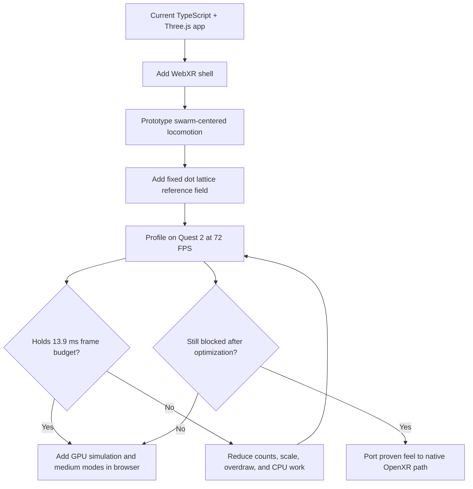
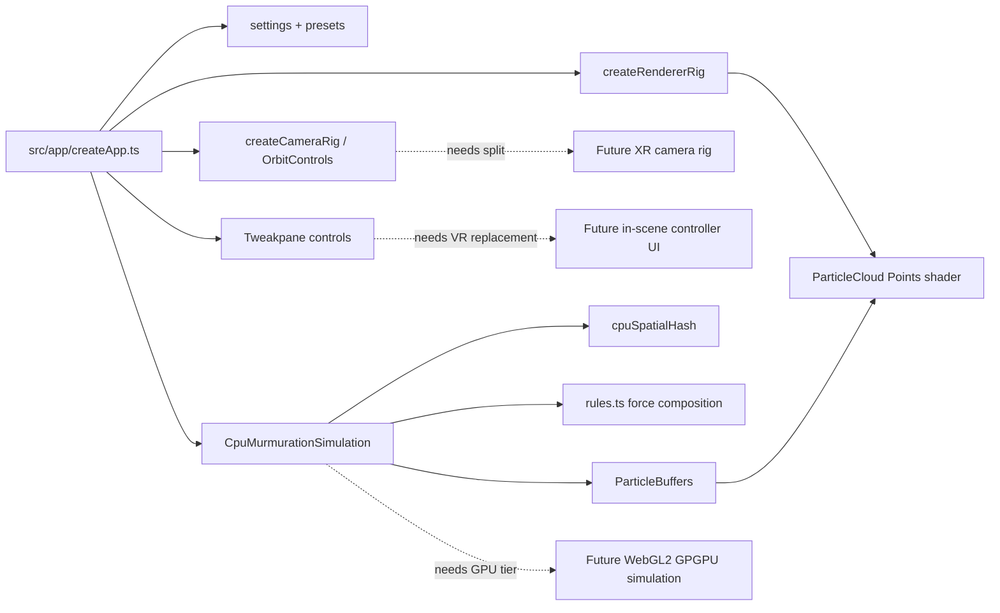
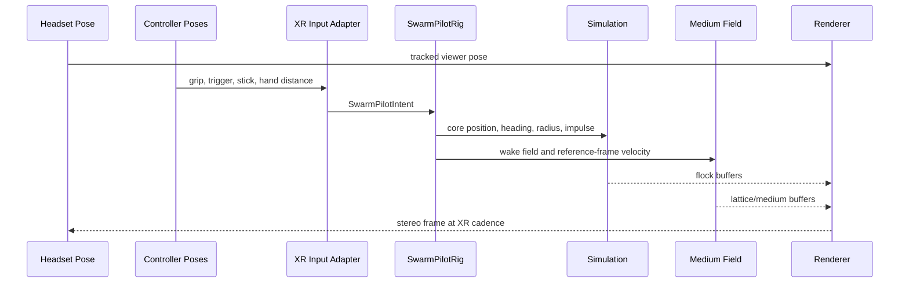
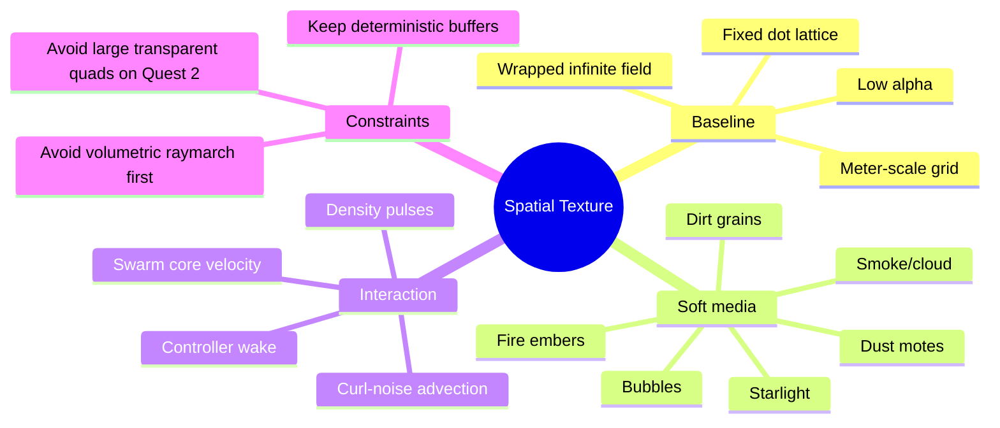
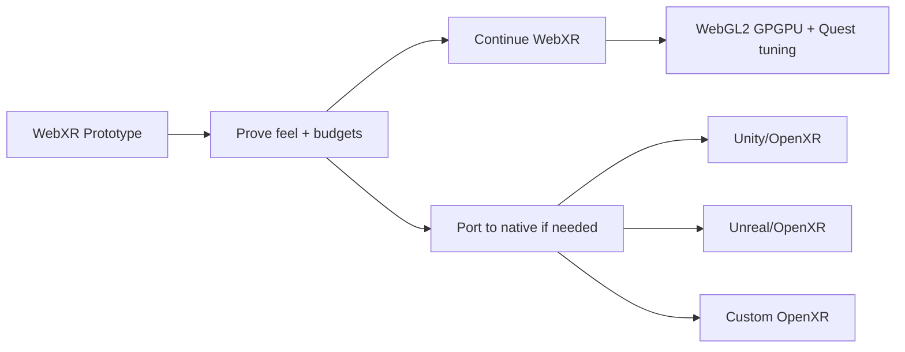
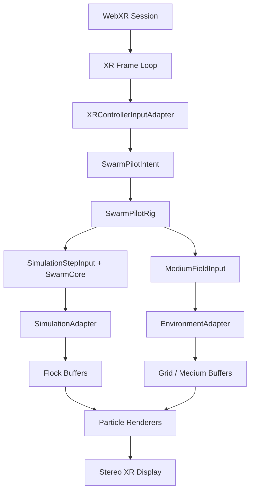
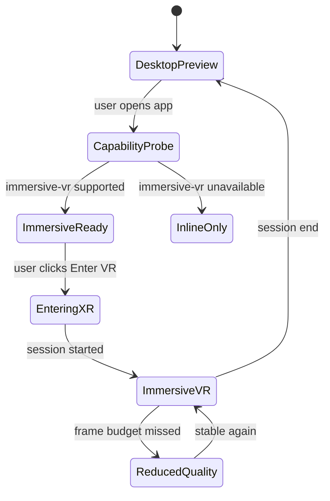

# Full 3D Immersive VR Swarm Simulation For Quest II

Status: `[_]` exploration  
Generated: 2026-06-03  
Repository: `/Users/crs/Documents/murmuration`  
Builds on: [`0000_[_]_WEB_BASED_THREE_DIMENSIONAL_MURMURATION_SIMULATION.md`](./0000_%5B_%5D_WEB_BASED_THREE_DIMENSIONAL_MURMURATION_SIMULATION.md)

## Problem Statement

Turn the current web-based Three.js murmuration into an immersive VR game or simulator where the player feels like they are inside the flock rather than observing it from outside. The target experience is a Quest 2-capable first prototype, with Quest 3 and other VR platforms treated as higher-headroom targets.

The desired interaction model is not "camera orbiting particles." It is closer to "being the center of a living swarm":

- The player flies with, through, and as the flock.
- Controller pose, sticks, triggers, and grips steer the swarm and the viewpoint.
- The player can zoom their perspective into and out of the swarm density.
- The space has enough texture to make motion legible without abandoning the minimal aesthetic.
- A baseline reference field can be a fixed dot lattice; richer modes can simulate dust, bubbles, smoke, water, fire, cloud, dirt, or starlight.
- The medium reacts softly to motion, but the Quest 2 budget requires approximate field responses rather than expensive per-particle collisions.

The core question: should this remain a browser-first TypeScript/WebXR application, or should it become a native VR game built with OpenXR, Unity, Unreal, Godot, or a custom native stack?

## Executive Summary 🧭

Start browser-first with WebXR, Three.js, WebGL2, and a Quest 2 performance envelope. The repo is already a TypeScript + Three.js app with a clean simulation/rendering/control split, so the lowest-risk next step is to add a VR mode around the existing architecture before considering a native port.

The first Quest 2 target should be deliberately conservative:

- Target `72 FPS`, not 90 or 120, because Meta's own Quest performance guidance treats 72 FPS as the minimum required VR frame rate and gives it a `13.9 ms` frame budget.
- Use `WebGLRenderer.xr`, `VRButton`, and `renderer.setAnimationLoop()` for the first immersive path.
- Replace orbit controls in VR with an `XRControllerInputAdapter` that emits a declarative `SwarmPilotIntent`.
- Keep desktop orbit controls as the non-VR preview mode.
- Use GPU point sprites or small impostors, not real sphere meshes.
- Keep the Quest 2 prototype near `2k-8k` flock particles plus `2k-8k` reference/medium particles until profiling proves more is safe.
- Treat the current CPU boids implementation as a correctness/debug path only. Quest 2 VR needs a WebGL2 GPGPU path or a much lighter field-driven approximation.
- Begin with a fixed dot lattice for spatial reference. Add medium modes as separate, cheaper "environment particles" that are advected by a flow field and the swarm core, not physically collided with every bird/fish/dot.

Native OpenXR should remain a fallback, not the first move. Unity/Unreal/OpenXR would offer stronger Quest profiling, app-store deployment, native foveated rendering controls, better controller/haptic integration, and less browser uncertainty. The cost is reimplementing the current TypeScript simulation, shaders, controls, presets, UI, and test strategy. That cost is not justified until a WebXR prototype proves the interaction is fun but cannot meet Quest 2 frame budgets.



## Current State In The Repository

Observed facts from the codebase:

- `package.json` defines a Vite + TypeScript app with `three`, `tweakpane`, and `vitest`.
- `src/app/createApp.ts` owns the main loop, settings, renderer, camera, CPU simulation, particle renderer, HUD, and settings pane.
- `src/simulation/CpuMurmurationSimulation.ts` implements CPU-side boids with spatial hashing and topological neighbor selection.
- `src/simulation/rules.ts` composes force terms declaratively: separation, alignment, cohesion, flow, noise, threat, and boundary.
- `src/rendering/ParticleCloud.ts` renders the swarm as a Three.js `Points` object with a custom sphere-like point shader.
- `src/camera/createCameraRig.ts` uses `OrbitControls`, so the current camera model is desktop observer-first rather than embodied VR.
- `src/controls/createPane.ts` exposes Tweakpane controls for simulation, visuals, and camera.
- `src/app/presets.ts` already contains named flock presets such as `Quiet Roost`, `Ink Cloud`, `Predator Ripple`, `Vacuole`, `Silk Sheet`, and `Storm Turn`.
- `src/app/settings.ts` already anticipates `renderMode`, `simulationMode`, `trailMode`, `targetFps`, `adaptiveQuality`, and GPU-ish texture planning helpers, but the code currently instantiates only `CpuMurmurationSimulation`.
- Tests exist for settings, presets, CPU spatial hash, CPU simulation, and themes.

Observed constraints:

- The current CPU simulation allocates fresh `Float32Array` buffers in each `step()`. That is acceptable for desktop prototyping but risky for VR, where garbage collection pauses and CPU frame spikes are comfort problems.
- The current HUD and settings panel are DOM overlays. Normal DOM UI is not automatically present inside immersive VR. VR controls need either controller-bound in-scene UI, a pre-VR desktop panel, or a WebXR-compatible overlay/module where supported.
- The app uses `window.requestAnimationFrame`. Three.js WebXR requires `renderer.setAnimationLoop()` so the browser/XR runtime can drive stereo presentation timing.
- Orbit camera state does not map to embodied locomotion. VR needs a separate rig where head pose is tracked by WebXR and the simulated swarm/world is transformed around the player.



Inference:

The current architecture is a good base because it already separates simulation state, rendering, settings, and camera concerns. The next phase should preserve that modularity and add an XR-specific app mode rather than rewriting everything as a game engine immediately.

## External Research 🔎

### Quest 2 Hardware And Frame Budget

Meta's Quest 2 launch notes state that Quest 2 uses the Qualcomm Snapdragon XR2 platform, includes `6GB` of RAM, and renders at `1832 x 1920` pixels per eye. Qualcomm's Quest 2 announcement describes the XR2 as purpose-built for XR and notes CPU/GPU gains over the previous Quest generation, but also frames the device as a battery-powered standalone headset rather than a desktop GPU replacement.

Meta's current optimization guidance for Quest apps gives the practical budget: all Meta Quest apps require at least `72 FPS`, which corresponds to `13.9 ms` per frame. Quest 3 and Quest 3S can also target 90 or 120 Hz, but Quest 2 should be treated as the baseline.

Sources:

- [Meta: Introducing Oculus Quest 2](https://about.fb.com/news/2020/09/introducing-oculus-quest-2-the-next-generation-of-all-in-one-vr/amp/)
- [Qualcomm: Snapdragon XR2 debuts in Oculus Quest 2](https://www.qualcomm.com/news/releases/2020/09/qualcomm-snapdragon-xr2-platform-commercially-debuts-oculus-quest-2)
- [Meta Horizon OS Developers: Basic Optimization Workflow for Apps](https://developers.meta.com/horizon/documentation/unreal/po-perf-opt-mobile//)

### Quest 3 As A Higher-Headroom Target

Qualcomm describes Snapdragon XR2 Gen 2 in Quest 3 as offering more than double the GPU performance of the previous generation. That makes Quest 3/3S a useful enhancement target, but the exploration should not let Quest 3 headroom hide Quest 2 problems. If the simulation works on Quest 2, it should scale up nicely on newer headsets.

Source:

- [Qualcomm: Snapdragon will power Meta Quest 3](https://www.qualcomm.com/snapdragon/news/snapdragon-will-power-the-meta-quest-3)

### WebXR And Three.js

WebXR supports `inline`, `immersive-vr`, and `immersive-ar` modes. Its value for this project is that the experience can be reached by URL, updated in place, and kept device-agnostic across compatible hardware. WebXR sessions require secure contexts and user activation; code should check `navigator.xr.isSessionSupported("immersive-vr")` before showing an enter-VR affordance.

Three.js already exposes the main pieces needed here:

- `renderer.xr.enabled = true`
- `VRButton.createButton(renderer)`
- `renderer.setAnimationLoop(render)`
- `renderer.xr.getController(index)` for target ray space
- `renderer.xr.getControllerGrip(index)` for controller grip space
- `renderer.xr.setFramebufferScaleFactor(value)` before the session starts
- `renderer.xr.setFoveation(value)` where supported

Three.js also documents that VR scene units should map to meters. That matters because the current simulation is dimensionless; VR comfort and input mapping need a stable meter scale.

Sources:

- [Immersive Web: What is WebXR?](https://immersiveweb.dev/)
- [MDN: XRSystem.requestSession()](https://developer.mozilla.org/en-US/docs/Web/API/XRSystem/requestSession)
- [MDN: Starting up and shutting down a WebXR session](https://developer.mozilla.org/en-US/docs/Web/API/WebXR_Device_API/Startup_and_shutdown)
- [Three.js Manual: WebXR basics](https://threejs.org/manual/en/webxr-basics.html)
- [Three.js Docs: WebXRManager](https://threejs.org/docs/pages/WebXRManager.html)

### Controller Input

WebXR input sources expose handedness, target/grip spaces, select and squeeze actions, and additional controls through a `gamepad` object. The WebXR Gamepads Module is specifically designed to expose controller buttons, triggers, thumbsticks, and touchpads for XR input sources.

That maps well to this simulator:

- Tracked controller pose can steer the swarm heading.
- Thumbsticks can control thrust, roll, density, or zoom.
- Trigger can add impulse or focus the flock.
- Grip/squeeze can gather, scatter, or "hold" the swarm.
- Two-hand distance can become an embodied zoom/density control.

Sources:

- [MDN: Inputs and input sources](https://developer.mozilla.org/en-US/docs/Web/API/WebXR_Device_API/Inputs)
- [Immersive Web: WebXR Gamepads Module](https://immersive-web.github.io/webxr-gamepads-module/)

### WebGPU Reality Check

WebGPU is the right long-term compute direction for particle simulation in browsers because it exposes general GPU compute and modern GPU APIs. Chrome reports Android support from Chrome 121 on Android 12+ devices with Qualcomm and ARM GPUs.

However, WebGPU and WebXR integration is still not safe as the initial Quest 2 production assumption. The WebXR/WebGPU binding has a specification flow involving an XR-compatible `GPUDevice`, a WebGPU-compatible session, and `XRGPUBinding`, but the Immersive Web status page currently marks WebXR/WebGPU bindings as not supported. For this repo, that means:

- WebGPU can be explored as a future non-XR or experimental path.
- The first Quest 2 WebXR path should use WebGL2 rendering.
- GPU simulation in immersive WebXR should start with WebGL2 GPGPU ping-pong textures, because Three.js WebXR is already WebGLRenderer-centered and WebXR/WebGL is the stable route.

Sources:

- [MDN: WebGPU API](https://developer.mozilla.org/en-US/docs/Web/API/WebGPU_API)
- [Chrome Developers: WebGPU overview](https://developer.chrome.com/docs/web-platform/webgpu/overview)
- [Immersive Web: WebXR status](https://immersiveweb.dev/)
- [Immersive Web: WebXR/WebGPU Binding Module](https://immersive-web.github.io/WebXR-WebGPU-Binding/)

### Development Tooling

Meta's Immersive Web Emulator can emulate WebXR on desktop Chromium browsers and claims compatibility on par with Meta Quest Browser for mainstream WebXR features. It is not a substitute for profiling on Quest 2, but it can reduce controller/input iteration time before headset testing.

Source:

- [Meta Quest GitHub: Immersive Web Emulator](https://github.com/meta-quest/immersive-web-emulator)

### Native OpenXR

OpenXR is a royalty-free cross-platform standard for XR apps. Meta also maintains a Meta OpenXR SDK with Quest-specific samples and APIs. Native OpenXR development is the more serious game-shipping path, but it is a larger migration from the current TypeScript application.

Sources:

- [Khronos: OpenXR](https://www.khronos.org/openxr/)
- [Meta Quest GitHub: Meta OpenXR SDK](https://github.com/meta-quest/Meta-OpenXR-SDK)

## Key Findings

### 1. The Player Should Be The Swarm Core, Not A Free Camera

The most important design decision is to distinguish "head pose" from "swarm/world locomotion."

In VR, the user's head pose should remain physically tracked and comfortable. The simulation can still create the sensation of flying by moving the flock and medium relative to a swarm core transform. This avoids treating the headset like a desktop camera that is artificially pitched, rolled, and translated every frame.

Recommended model:

- The user's physical head controls looking around.
- A `SwarmPilotRig` owns the simulated core position, velocity, heading, roll, and density radius.
- The flock tends to orbit, follow, and respond around that core.
- The environment reference field flows past the core, giving motion context.
- Loop-to-loop style movement exists as an advanced comfort mode where the swarm/world rotates, not as forced head rotation.



### 2. Quest 2 Needs A Different Definition Of "Massive"

For desktop, `100k` particles is a reasonable aspirational target. For Quest 2 VR, "massive" should mean enough visual density to feel enveloping at 72 FPS, not maximum particle count.

Initial Quest 2 budgets should be staged:

| Stage | Flock count | Medium/reference count | Simulation | Rendering | Purpose |
| --- | ---: | ---: | --- | --- | --- |
| VR smoke test | 512-2,000 | 1,000-2,000 | CPU or field-follow | Point sprites | Verify WebXR, scale, controller mapping |
| Quest 2 feel prototype | 2,000-8,000 | 2,000-8,000 | Optimized CPU or WebGL2 GPGPU | Small point sprites | Make flying feel good |
| Quest 2 stretch | 8,000-16,000 | 8,000-16,000 | WebGL2 GPGPU | Minimal impostors | Test density and adaptive quality |
| Quest 3 enhancement | 16,000-64,000 | 16,000-64,000 | WebGL2 GPGPU or WebGPU experiment | Higher scale/trails | Add visual richness |

Inference:

The current default `8000` particles may be acceptable in desktop non-VR but should not be assumed safe in Quest 2 immersive VR until the app is profiled on device. Stereo rendering, XR compositor overhead, thermal throttling, and controller/head tracking all reduce available headroom.

### 3. The Fixed Dot Grid Is The Right First Spatial Medium

The user's idea of starting with a fixed grid of dots is the correct baseline. It solves the core perceptual problem with the least simulation cost.

Baseline reference field:

- A sparse 3D lattice around the player, e.g. `32 x 16 x 32` logical cells with jitter.
- Render only a shell or sliding window around the player.
- Use deterministic wrapping so it feels infinite.
- Fade by depth and distance from the center.
- Apply tiny noise drift only after the static reference works.

Then add medium modes:

| Medium | Visual shape | Behavior | Quest 2 risk |
| --- | --- | --- | --- |
| Grid | Fixed dots | Infinite wrapping lattice | Low |
| Dust | Sparse motes | Advected by wake and curl noise | Low |
| Air | Almost invisible motes | Directional streaks near speed | Low |
| Water | Bubbles/soft specks | Slower, viscous drag, larger near-field particles | Medium alpha overdraw |
| Cloud | Soft puffs | Layered billboards or particles | High overdraw if too large |
| Fire | Embers | Additive points, upward turbulence | Medium fill/blend cost |
| Dirt | Granular flecks | Heavier, slower, clumpy | Low-medium |
| Starlight | Distant point field | Parallax layers, sparse bright points | Low |



### 4. The Medium Should Be A Field, Not A Collision System

The phrase "substances behave differently to being bumped into" can become expensive if implemented literally as collisions between the flock and all environmental particles.

Recommended approximation:

- Represent each medium as parameters in a low-frequency flow field.
- Let flock particles sample the field for drag, turbulence, and wake response.
- Let medium particles sample the same field plus a player/swarm wake impulse.
- Use signed distance-ish influence around controller poses and swarm core, not particle-to-particle collision.
- Reserve actual collision only for rare fixed anchors or gameplay objects.

This gives the feeling of viscosity and material response while keeping the algorithm GPU-friendly.

### 5. Browser-First Is Still The Right First Move

Reasons to keep the first VR prototype web-based:

- The repo is already TypeScript/Three.js.
- WebXR is enough to test the interaction model on Quest 2.
- No app install is needed; iteration can happen through a local HTTPS URL.
- Existing shader and settings architecture can be reused.
- The simulator is visually minimal, so it does not need Unity/Unreal asset pipelines yet.

Reasons the browser may eventually fail:

- Quest Browser performance can be tighter than native.
- WebXR DOM overlays and browser-specific support are limited.
- WebGPU/WebXR integration is not a stable initial assumption.
- Native profiling and foveated rendering controls are better supported.
- Shipping as a polished Quest store game may require native packaging anyway.

Recommendation:

Use WebXR until the team can answer two questions empirically:

- Is swarm-centered controller flight fun?
- Can Quest 2 hold 72 FPS with acceptable density?

Only port after those answers are known.

## Options And Tradeoffs

### Option A: Browser-First WebXR Prototype

Use current TypeScript + Three.js + Vite app. Add WebXR mode, controller input, a reference field, and later WebGL2 GPGPU simulation.

Pros:

- Lowest migration cost.
- Fastest path to testing the actual "be the swarm" interaction.
- Keeps current tests, settings, presets, shaders, and app structure.
- Easy to share by URL.
- Works across Quest, desktop WebXR, and inline preview where supported.

Cons:

- Quest 2 performance may cap particle density.
- WebXR feature support varies by browser.
- WebGPU/WebXR is not dependable as the first compute/render path.
- DOM controls need rethinking in immersive mode.
- Native haptics, profiling, and store release paths are weaker.

Best use:

- First playable VR feel prototype.
- Device capability discovery.
- Controller mapping exploration.

### Option B: Unity + OpenXR / Meta XR

Rebuild as a native Unity Quest app using OpenXR and Meta XR SDK features where needed.

Pros:

- Strong Quest deployment path.
- Better mobile VR profiling and graphics controls.
- Easier access to native haptics, foveation, platform UI, hand/controller features, and store packaging.
- Larger pool of VR game patterns and tooling.

Cons:

- Requires porting TypeScript simulation and shaders to C#/HLSL/Shader Graph or compute shaders.
- More app scaffolding and build complexity.
- The current functional/declarative TypeScript style would need deliberate preservation.
- Web sharing and instant update benefits are reduced.

Best use:

- After WebXR proves the concept but cannot hit Quest 2 performance or platform polish.

### Option C: Unreal + OpenXR / Meta XR

Build a native Unreal version.

Pros:

- Strong rendering/profiling stack.
- Meta docs expose foveated rendering and optimization workflows.
- Good fit for a production VR title with richer scenes.

Cons:

- Heavyweight for a minimal particle simulator.
- C++/Blueprint architecture is a bigger departure from the repo.
- GPU particle customization can become engine-specific quickly.

Best use:

- If the project grows into a visually rich commercial VR game with environments, progression, and authored content.

### Option D: Custom Native OpenXR

Use C++/Rust/wgpu/OpenXR for a custom renderer/simulation.

Pros:

- Maximum control over performance and memory.
- Clean conceptual match for GPU particle simulation.
- Portable OpenXR foundation.

Cons:

- Highest engineering cost.
- Loses existing app momentum.
- Harder UI/tooling/test workflow.

Best use:

- Only if the project becomes a performance-first research/simulation engine.

### Option E: Hybrid Strategy

Prototype in WebXR, keep simulation kernels and control semantics portable, then port only after the feel and budgets are understood.

Pros:

- Preserves current speed.
- Avoids premature native migration.
- Produces reusable design artifacts: control intent API, shader logic, simulation field math, presets.

Cons:

- Requires discipline to avoid browser-only assumptions.
- Some code will still be rewritten if native happens.

Best use:

- Recommended path.



## Recommended Architecture

### Module Boundaries

Add VR through new adapters rather than mutating desktop modules into XR-specific code.

Suggested additions:

```text
src/
  xr/
    createXrSessionButton.ts
    createXrCameraRig.ts
    createXrControllerRig.ts
    inputIntent.ts
    swarmPilotRig.ts
    comfort.ts
  environment/
    referenceGrid.ts
    mediumField.ts
    mediumPresets.ts
    EnvironmentParticles.ts
  simulation/
    webglGpuSimulation.ts
    simulationFactory.ts
  rendering/
    xrQuality.ts
```

The important shape is:

- `inputIntent.ts` converts raw XR input sources into semantic controls.
- `swarmPilotRig.ts` integrates those controls into a stable swarm core transform.
- `mediumField.ts` defines the material behavior of space.
- `referenceGrid.ts` is the first cheap reference medium.
- `simulationFactory.ts` chooses CPU/WebGL/WebGPU-capable paths by device and settings.
- `xrQuality.ts` owns render scale, foveation, particle count caps, and adaptive quality.



### Runtime Modes

The app should support three runtime modes:

| Mode | Trigger | Camera/control | Purpose |
| --- | --- | --- | --- |
| Desktop preview | Normal browser | OrbitControls + pane | Tune presets and debug |
| Inline/mobile preview | No headset | Pointer/touch fallback | Shareable non-VR experience |
| Immersive VR | `immersive-vr` supported | WebXR head pose + controllers | Target simulator |



### Swarm Pilot Intent API

A declarative input state keeps controls testable and portable across WebXR and native.

```ts
export type SwarmPilotIntent = Readonly<{
  thrust: number;
  yaw: number;
  pitch: number;
  roll: number;
  gather: number;
  scatter: number;
  zoom: number;
  mediumPulse: number;
  preferredHeading: readonly [number, number, number] | null;
  leftHandPosition: readonly [number, number, number] | null;
  rightHandPosition: readonly [number, number, number] | null;
}>;
```

That intent can come from:

- WebXR controllers.
- Desktop keyboard/pointer fallback.
- Future native OpenXR actions.
- Automated test fixtures.

### Controller Mapping

Initial Quest Touch mapping:

| Input | Proposed behavior | Reason |
| --- | --- | --- |
| Right controller aim | Preferred swarm heading | Feels like pointing the flock through space |
| Right thumbstick Y | Forward/back thrust | Familiar locomotion |
| Right thumbstick X | Yaw bias | Fine steering without arm fatigue |
| Right trigger | Boost / excite flock | Natural "go" action |
| Right grip | Cohere around pilot core | Natural squeeze/gather metaphor |
| Left thumbstick Y | Zoom in/out through swarm radius | Continuous density/perspective control |
| Left thumbstick X | Roll bias | Supports loops without forcing head roll by default |
| Left trigger | Medium pulse / wake | Makes space visibly react |
| Left grip | Scatter / expand swarm | Complement to gather |
| Hands together/apart | Optional embodied zoom or density radius | Strong VR gesture, but should be optional |
| A/B/X/Y | Cycle medium/preset/comfort mode | Low-frequency controls |

Comfort defaults:

- No automatic head roll.
- Roll the swarm/world frame around the user only when explicitly enabled.
- Cap acceleration and angular velocity.
- Add optional vignette or density tunnel at high speed.
- Provide "comfort flight" and "acro flight" presets.

### Simulation Design

The current CPU boids implementation is good for rule correctness. VR needs two additional ideas:

1. A swarm core field.
2. A GPU-friendly approximation.

New force terms:

- `pilotHeadingForce`: bias particles toward the pilot's desired heading.
- `pilotCohesionForce`: keep the swarm centered around the moving core without collapsing.
- `pilotShellForce`: maintain a density ball/shell around the player so the user is inside the swarm.
- `mediumDragForce`: vary inertia by medium.
- `wakeForce`: let controller or swarm motion push nearby medium/flock particles.

Avoid:

- Per-particle collisions between flock and environment particles.
- Full fluid simulation on Quest 2.
- CPU nearest-neighbor sorting for high particle counts in VR.

### Rendering Design

Keep visual forms sparse and readable:

- Flock particles: small point impostors, depth fade, velocity tint/opacity, maybe very short trails.
- Reference grid: tiny fixed dots with wrapped positions, low alpha, subtle parallax.
- Dust/water/fire/etc.: separate point cloud with medium-specific shader uniforms.
- UI: minimal controller-bound indicators, not floating panels everywhere.

Quest 2-specific rendering controls:

- Set XR framebuffer scale before entering the session.
- Use foveation where available.
- Keep `pixelRatioCap` lower in XR than desktop.
- Avoid large soft transparent sprites in cloud/water modes.
- Use adaptive quality based on frame time.
- Separate flock and medium draw calls, but keep draw calls low.

## Recommendation

Implement a WebXR Quest 2 prototype in five passes.

### Pass 1: XR Shell

Convert the render loop to `renderer.setAnimationLoop()`, enable `renderer.xr`, add `VRButton`, and keep the current desktop path working. Use a tiny static test field first, then reconnect the existing `ParticleCloud`.

Goal:

- Enter immersive VR from Quest Browser.
- Render current particles in stereo.
- Exit session cleanly.
- Maintain desktop preview.

### Pass 2: Controller Intent

Add `SwarmPilotIntent` and an `XRControllerInputAdapter`. Do not directly mutate simulation settings from raw button reads. Convert raw XR sources into a small semantic intent object and test that mapping independently.

Goal:

- Right hand steers.
- Stick thrust moves the swarm core.
- Triggers/grips produce gather/scatter/boost states.
- Desktop fallback can produce the same intent type.

### Pass 3: Swarm-Centered Locomotion

Add `SwarmPilotRig` and pilot-aware force terms. The player should feel centered inside the moving flock, with enough freedom to look around naturally.

Goal:

- The flock follows the pilot core.
- The user can zoom/densify the local swarm radius.
- Movement feels legible without a medium yet.

### Pass 4: Reference Grid And Medium Field

Add the fixed dot lattice first. Then add dust/air/starlight modes because they are point-based and cheap. Defer water/cloud/fire until the frame budget is stable.

Goal:

- Motion through space is understandable.
- No fixed world objects are required.
- Medium modes affect drag/turbulence visually and physically.

### Pass 5: Quest 2 Performance Tier

Replace or augment CPU simulation with a WebGL2 GPGPU adapter and adaptive quality. Treat WebGPU as future research until WebXR/WebGPU support is stable enough on target browsers.

Goal:

- Hold 72 FPS on Quest 2.
- Avoid per-frame allocation spikes.
- Keep density convincing at practical particle counts.

## Implementation Checklist

- [x] Convert the app loop from `window.requestAnimationFrame` to `renderer.setAnimationLoop()` while preserving desktop behavior.
- [x] Add a WebXR capability probe using `navigator.xr?.isSessionSupported("immersive-vr")`.
- [x] Enable `renderer.xr.enabled`, configure XR reference space, framebuffer scale, and foveation before session start.
- [x] Add a VR entry button through Three.js `VRButton` or a custom equivalent.
- [x] Split desktop `OrbitControls` from immersive `XrCameraRig`.
- [x] Add `SwarmPilotIntent` as the semantic input contract.
- [x] Add an `XRControllerInputAdapter` that reads WebXR input sources and `gamepad` state.
- [x] Add desktop fallback input that emits the same `SwarmPilotIntent`.
- [x] Add `SwarmPilotRig` with core position, velocity, heading, radius, roll, and comfort limits.
- [x] Extend `SimulationStepInput` with a pilot/swarm-core field instead of passing only `threatPosition`.
- [x] Add pilot-aware force terms in `rules.ts`.
- [x] Remove per-frame allocations from the CPU simulation path or isolate CPU simulation to low-count debug mode.
- [x] Add `EnvironmentAdapter` and `ReferenceGrid` modules.
- [x] Add wrapped fixed dot lattice rendering as the first spatial reference mode.
- [x] Add low-cost dust, air, and starlight medium presets.
- [x] Add medium parameters for drag, turbulence, wake response, point size, opacity, and color/theme behavior.
- [x] Add adaptive Quest 2 quality caps for particle counts, render scale, and medium complexity.
- [x] Prototype WebGL2 GPGPU ping-pong textures for position/velocity updates.
- [x] Keep WebGPU exploration behind capability flags and outside the critical Quest 2 path until WebXR/WebGPU binding support is proven on device.
- [x] Add in-scene minimal VR UI for mode/preset feedback.
- [x] Add haptic pulses where WebXR/browser support allows it, but keep the simulator playable without haptics.
- [x] Add comfort presets: `Comfort Flight`, `Swarm Pilot`, and `Acro Swarm`.
- [x] Create Quest 2-specific presets with lower counts and smaller point sizes than desktop.
- [x] Document local HTTPS device testing and remote debugging workflow.

## Validation Checklist

- [x] Desktop preview still runs with orbit controls and Tweakpane.
- [ ] Quest 2 can enter immersive VR from a secure local or hosted URL.
- [ ] Quest 2 can render the current particle cloud in stereo without controller input.
- [ ] Controller handedness is detected correctly on Quest Touch controllers.
- [ ] Trigger, grip, and thumbstick mappings produce stable `SwarmPilotIntent` values.
- [ ] The user can steer and thrust without forced head rotation.
- [ ] Zoom/density control changes the felt swarm radius without disorientation.
- [ ] Fixed dot lattice makes direction and speed legible.
- [ ] Dust/air/starlight modes preserve a minimal aesthetic.
- [ ] Water/cloud/fire modes do not exceed overdraw budgets before they are enabled in Quest 2 presets.
- [ ] Quest 2 holds 72 FPS for 5 minutes in `Comfort Flight`.
- [ ] Quest 2 holds 72 FPS for 5 minutes in the densest Quest 2 preset.
- [ ] No avoidable `Float32Array` allocations occur in the hot VR frame path.
- [ ] Adaptive quality reduces count/render scale before dropping below comfort frame rate for sustained periods.
- [ ] Exiting XR returns cleanly to desktop preview.
- [x] App handles missing WebXR support gracefully.
- [x] App handles missing `gamepad` state gracefully.
- [x] App handles one-controller mode gracefully.
- [x] Tests cover controller intent reduction, pilot rig integration, medium presets, and simulation input clamping.
- [x] Profiling distinguishes CPU-bound, vertex-bound, and fragment-bound cases.

## Example Code

This example shows the shape of the first WebXR shell and controller intent reducer. It is intentionally small and aligned with the current app architecture.

```ts
import { Vector3, type Object3D, type WebGLRenderer } from "three";
import { VRButton } from "three/examples/jsm/webxr/VRButton.js";

export type SwarmPilotIntent = Readonly<{
  thrust: number;
  yaw: number;
  pitch: number;
  roll: number;
  gather: number;
  scatter: number;
  zoom: number;
  mediumPulse: number;
  preferredHeading: readonly [number, number, number] | null;
}>;

export const neutralSwarmPilotIntent: SwarmPilotIntent = {
  thrust: 0,
  yaw: 0,
  pitch: 0,
  roll: 0,
  gather: 0,
  scatter: 0,
  zoom: 0,
  mediumPulse: 0,
  preferredHeading: null,
};

const buttonValue = (gamepad: Gamepad | null | undefined, index: number): number =>
  gamepad?.buttons[index]?.value ?? 0;

const axisValue = (gamepad: Gamepad | null | undefined, index: number): number =>
  gamepad?.axes[index] ?? 0;

const add = (left: SwarmPilotIntent, right: Partial<SwarmPilotIntent>): SwarmPilotIntent => ({
  ...left,
  ...right,
  thrust: left.thrust + (right.thrust ?? 0),
  yaw: left.yaw + (right.yaw ?? 0),
  pitch: left.pitch + (right.pitch ?? 0),
  roll: left.roll + (right.roll ?? 0),
  gather: Math.max(left.gather, right.gather ?? 0),
  scatter: Math.max(left.scatter, right.scatter ?? 0),
  zoom: left.zoom + (right.zoom ?? 0),
  mediumPulse: Math.max(left.mediumPulse, right.mediumPulse ?? 0),
  preferredHeading: right.preferredHeading ?? left.preferredHeading,
});

export const readControllerIntent = (
  inputSources: Iterable<XRInputSource>,
): SwarmPilotIntent =>
  Array.from(inputSources).reduce<SwarmPilotIntent>((intent, source) => {
    const gamepad = source.gamepad;
    const handedness = source.handedness;

    if (handedness === "right") {
      return add(intent, {
        thrust: -axisValue(gamepad, 3),
        yaw: axisValue(gamepad, 2),
        gather: buttonValue(gamepad, 1),
        mediumPulse: buttonValue(gamepad, 0),
      });
    }

    if (handedness === "left") {
      return add(intent, {
        zoom: -axisValue(gamepad, 3),
        roll: axisValue(gamepad, 2),
        scatter: buttonValue(gamepad, 1),
      });
    }

    return intent;
  }, neutralSwarmPilotIntent);

export const enableWebXr = (
  renderer: WebGLRenderer,
  host: HTMLElement,
): HTMLElement => {
  renderer.xr.enabled = true;
  renderer.xr.setReferenceSpaceType("local-floor");
  renderer.xr.setFramebufferScaleFactor(0.85);
  renderer.xr.setFoveation(0.65);

  const button = VRButton.createButton(renderer, {
    optionalFeatures: ["local-floor", "bounded-floor"],
  });

  host.append(button);
  return button;
};

export const preferredHeadingFromGrip = (controllerGrip: Object3D) => {
  const direction = new Vector3(0, 0, -1);
  direction.applyQuaternion(controllerGrip.quaternion).normalize();

  return [direction.x, direction.y, direction.z] as const;
};
```

Notes for implementation:

- The exact Quest Touch button indices should be verified on device and normalized through a small mapping layer. Do not scatter raw indices throughout the app.
- `setFramebufferScaleFactor()` must be called before an XR session starts.
- The real implementation should derive right-controller heading from `renderer.xr.getControllerGrip(index)` or the input source grip pose during the XR frame.
- The reducer style keeps the control mapping functional and testable.

## Risks And Unknowns

### Quest Browser Performance

Unknown:

- How many flock and medium particles Quest 2 can sustain in the current shader style.
- Whether the app is CPU-bound from simulation, vertex-bound from point count, or fragment-bound from soft transparent particles.

Mitigation:

- Add a Quest 2 profiling preset early.
- Record frame time, particle count, pixel ratio, draw calls, and mode.
- Test render-only and simulation-only toggles to isolate bottlenecks.

### Motion Comfort

Unknown:

- Whether loop-to-loop swarm movement feels good in headset.
- Whether users prefer hand-pointing, thumbstick steering, or both.

Mitigation:

- Start with comfort flight.
- Make roll explicit and optional.
- Keep head tracking physically grounded.
- Add acro mode only after baseline feels good.

### WebXR Feature Variability

Unknown:

- Exact Quest Browser support for optional features such as layers, foveation, hand tracking, and haptics can vary by device/browser version.

Mitigation:

- Probe capabilities at runtime.
- Keep optional features optional.
- Test on Quest 2 hardware, not only desktop emulation.

### GPU Simulation Complexity

Unknown:

- Whether the desired flock behavior can be preserved in a WebGL2 texture-based GPGPU approximation.

Mitigation:

- Keep CPU simulation as the behavioral reference.
- Move one force at a time to GPU.
- Use presets to compare CPU and GPU feel.

### Native Migration Cost

Unknown:

- How much of the shader and simulation logic would need rewriting if the project ports to Unity/OpenXR.

Mitigation:

- Keep simulation math in small pure functions.
- Keep controller semantics as declarative intent.
- Document shader equations and presets in engine-neutral terms.

## Next Actions

1. Add a small WebXR shell to the current app without changing simulation behavior.
2. Verify Quest 2 can enter VR and render the current point cloud.
3. Add `SwarmPilotIntent` and controller input tests.
4. Add a fixed dot lattice reference field.
5. Profile Quest 2 before adding richer medium simulations.
6. Decide whether WebGL2 GPGPU is enough for the first dense VR prototype.
7. Revisit native OpenXR only after the browser path has real Quest 2 measurements.

## References

- [Previous exploration: Web-Based Three-Dimensional Murmuration Simulation](./0000_%5B_%5D_WEB_BASED_THREE_DIMENSIONAL_MURMURATION_SIMULATION.md)
- [Meta: Introducing Oculus Quest 2](https://about.fb.com/news/2020/09/introducing-oculus-quest-2-the-next-generation-of-all-in-one-vr/amp/)
- [Qualcomm: Snapdragon XR2 debuts in Oculus Quest 2](https://www.qualcomm.com/news/releases/2020/09/qualcomm-snapdragon-xr2-platform-commercially-debuts-oculus-quest-2)
- [Qualcomm: Snapdragon will power Meta Quest 3](https://www.qualcomm.com/snapdragon/news/snapdragon-will-power-the-meta-quest-3)
- [Meta Horizon OS Developers: Basic Optimization Workflow for Apps](https://developers.meta.com/horizon/documentation/unreal/po-perf-opt-mobile//)
- [Meta Horizon OS Developers: Using Fixed Foveated Rendering](https://developers.meta.com/horizon/documentation/unreal/unreal-ffr/?locale=en_US)
- [Immersive Web: WebXR overview and status](https://immersiveweb.dev/)
- [MDN: XRSystem.requestSession()](https://developer.mozilla.org/en-US/docs/Web/API/XRSystem/requestSession)
- [MDN: Starting up and shutting down a WebXR session](https://developer.mozilla.org/en-US/docs/Web/API/WebXR_Device_API/Startup_and_shutdown)
- [MDN: Inputs and input sources](https://developer.mozilla.org/en-US/docs/Web/API/WebXR_Device_API/Inputs)
- [Immersive Web: WebXR Gamepads Module](https://immersive-web.github.io/webxr-gamepads-module/)
- [Three.js Manual: WebXR basics](https://threejs.org/manual/en/webxr-basics.html)
- [Three.js Docs: WebXRManager](https://threejs.org/docs/pages/WebXRManager.html)
- [MDN: XRProjectionLayer fixed foveation](https://developer.mozilla.org/en-US/docs/Web/API/XRProjectionLayer)
- [MDN: WebGPU API](https://developer.mozilla.org/en-US/docs/Web/API/WebGPU_API)
- [Chrome Developers: WebGPU overview](https://developer.chrome.com/docs/web-platform/webgpu/overview)
- [Immersive Web: WebXR/WebGPU Binding Module](https://immersive-web.github.io/WebXR-WebGPU-Binding/)
- [Meta Quest GitHub: Immersive Web Emulator](https://github.com/meta-quest/immersive-web-emulator)
- [Meta Quest GitHub: Immersive Web Emulation Runtime](https://meta-quest.github.io/immersive-web-emulation-runtime/)
- [Khronos: OpenXR](https://www.khronos.org/openxr/)
- [Meta Quest GitHub: Meta OpenXR SDK](https://github.com/meta-quest/Meta-OpenXR-SDK)
